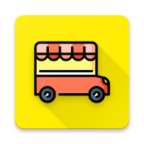

# FoodTruck Locator

Introdution
--------
(Food Truck locator - Graduation project)
"Food Truck" Application helps to connect between the customer and the Food Truck owner since the food truck moves from a place to another. The customer can find the nearby trucks and also can see the menu and prices. 

The app enables the customer to make orders from the food trucks. The app gives the Truck owners additional way to increase their revenue by having more customers with nearby truck feature, also helps the Truck owners to be found by their customers, and they can offer their new products by updating the menu.

Features
--------
-	Truck’s owner can add menu.
-	Truck’s owner can update the menu. 
-	Truck’s owner can update their location.  
-	Truck’s owner can update their truck state (open or closed). 
-	Customer can see the truckList.
-	Customer can rate the Food trucks
-	Customer can see the nearby Food trucks (MapView).
- Review System (rating).
- Order System: Customer can make order from trucks to prepare order.
- Trucks can accept or reject the order.
