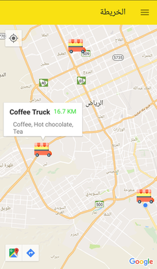

# FoodTruck Locator

Introdution
--------
"Food Truck" Application (Graduation Project) helps to connect between the customer and the Food Truck owner since the food truck moves from a place to another. The customer can find the nearby trucks and also can see the menu and prices. 

The app gives the Truck owners additional way to increase their revenue by having more customers with nearby truck feature, also can have more orders by Order system feature which allows customers to making orders from the trucks.

Features
--------
-	Truck’s owner can add menu.
-	Truck’s owner can update the menu. 
-	Truck’s owner can update their location.  
-	Truck’s owner can update their truck state (open or closed). 
-	Customer can see the truckList.
-	Customer can rate the Food trucks
-	Customer can see the nearby Food trucks (MapView).
- Review System (rating).
- Order System: Customer can make order from trucks to prepare order. (with receiving notification)
- Trucks can accept or reject the order.

Screenshot
--------

Download
--------
You can find alpha 0.1 version [HERE][1]

[1]: https://github.com/nawaf11/FoodTruck/releases

